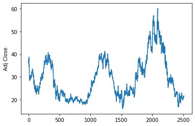
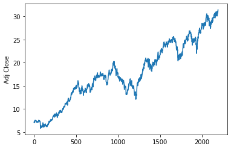

# Machine Learning Engineer Nanodegree
## Capstone Project
Arnab Karmakar
Feb 29th, 2020

## I. Definition

### Project Overview

Stock market is one of the most competitive financial markets. Traders need to compute the financial workloads with low latency and high throughput. In the past, people were using the traditional store and process method to calculate the heavy financial workloads efficiently. However to achieve low latency and high throughput, data-centers were forced to be physically located close to the data sources, instead of other more economically beneficial locations. This is the main reason, the data-streaming model was developed and it can process large amount of data more efficiently. It was shown in studies that using data streaming we can solve the options pricing and risk assessment problems using traditional methods, for example Japanese candlesticks, Monte-Carlo models, Binomial models, with low latency and high throughput. However instead of using those traditional methods, we approached the problems using machine learning techniques. We tried to revolutionize the way people address data processing problems in stock market by predicting the behaviour of the stocks. In fact, if we can predict how the stock will behave in the short-term future we can queue up our transactions earlier and be faster than everyone else. In theory, this allows us to maximize our profit without having the need to be physically located close to the data sources.

We examined two models.

**Model 1** - We used a complete random model using a random number genertor. If the generated number is greater than `.7` (inclusive), we buy a stock and if it is less than `.3` (inclusive) we sell. We do nothing if the generated number is between `.3` (exclusive) and `.7`  (exclusive). We close our position just before the exchange closes for the day.

**Model 2** - In this model, we use multiple machine learning algorithms to get the final decision. For example, we will use classification techniques to classify stocks into different buckets (For us, it is three). Then we train three neural networks for these three buckets and take position in the market based on confidence levels of predicted values from these networks. Each of those models are applied on real stock market data and checked whether it could return profit.

### Problem Statement

For the concept of this thesis we tried to predict the price of the stock in the short term future and decide whether it is better to buy, sell our stocks or do nothing(no trading). There is no strict definition of short term future. It can be any interval from nanoseconds until a few days. We decided that we will use 1-day interval as our prediction time. As the stock price depends on the time, time interval is a parameter that had to be decided. We think that 1-day can be a good representation of short term future. Also using a constant time interval simplifies the problem significantly. The main objective is to maximize the profit by trying to increase the capital. We tried to come up with an optimal trading strategy to maximize the potential profit. The main idea is to model a stock trading into 1-day intervals and using historical information of the stock, we tried to predict if we should avoid trading or take a position which would either end above or below our entry price in the stock. We tried to train and test our model on historical stock data collected during the period of November 2010 to June 2019.

### Metrics

Our metrics is completely based on number of successful trades. While building the model, we considered a threshold of 40% change as minimum change for taking a trade. For example, model is going to predict BUY if it thinks that the change is going to be 40% higher than the opening price. Similarly, it will predict SELL if the prediction is 40% lower than the opening price. Anything in between will be considered no trade zone. Finally, based on how many of the the above trades are closed successfully, our model will be evaluated for accuracy. More details on model evalution is [here](###Model-Evaluation-and-Validation)

Economist believe that stock market follows Random Walk theory. Random walk theory suggests that changes in stock prices have the same distribution and are independent of each other. Therefore, it assumes the past movement or trend of a stock price or market cannot be used to predict its future movement. In short, random walk theory proclaims that stocks take a random and unpredictable path that makes all methods of predicting stock prices futile in the long run. Considering that theory, we believe that a random number generator would be best for bench mark evaluation. A benchmark model is described [here](###BenchMark). If our model performs better than random walk based on accuracy as defined above, we would consider our approach as a successful one.

## II. Analysis

### Data Exploration

There are two types of data we have to download from external sources, the list of stocks we want to analyze and then prices for each stock in the given time period for analysis. [DataHub](https://datahub.io/core/nyse-other-listings) provides API to download list of tickers(instruments).

Head:
| Symbol |                                       Description                                        |
| ------ | ---------------------------------------------------------------------------------------- |
|   A    |                         Agilent Technologies, Inc. Common Stock                          |
|   AA   |                                 Alcoa Inc. Common Stock                                  |
|  AA$B  | Alcoa Inc. Depository Shares Representing 1/10th Preferred Convertilble Class B Series 1 |
|  AAC   |                             AAC Holdings, Inc. Common Stock                              |
|  AAN   |                                Aaron's, Inc. Common Stock                                |

Tail:
| Symbol |                                                Description                                                 |
| ------ | ---------------------------------------------------------------------------------------------------------- |
|  ZPIN  |              Zhaopin Limited American Depositary Shares, each reprenting two Ordinary Shares               |
|  ZQK   |                                       Quiksilver, Inc. Common Stock                                        |
|  ZTR   |                              Zweig Total Return Fund, Inc. (The) Common Stock                              |
|  ZTS   |                                      Zoetis Inc. Class A Common Stock                                      |
|   ZX   | China Zenix Auto International Limited American Depositary Shares, each representing four ordinary shares. |

Shape: (3298, 2)

We collected 3298 tickers. We are now going to download last traded volume for each of these tickers. It is possible that yahoo might not have data for all the tickers. We are going to explore and use data which are available.

Head:
| Symbol |                    Description                    | Last Volume |
| ------ | ------------------------------------------------- | ----------- |
|   A    |      Agilent Technologies, Inc. Common Stock      |  1712146.0  |
|   AA   |              Alcoa Inc. Common Stock              |  4695503.0  |
|  AAP   | Advance Auto Parts Inc Advance Auto Parts Inc W/I |  1065904.0  |
|  AAT   |      American Assets Trust, Inc. Common Stock     |   275667.0  |
|  ABB   |                ABB Ltd Common Stock               |  1777283.0  |

Tail:
| Symbol |               Description                | Last Volume |
| ------ | ---------------------------------------- | ----------- |
|  WGO   | Winnebago Industries, Inc. Common Stock  |   635929.0  |
|  WHG   | Westwood Holdings Group Inc Common Stock |   35491.0   |
|  WHR   |    Whirlpool Corporation Common Stock    |   912040.0  |
|  WIA   |     Western Asset/Claymore Inflation     |   42550.0   |
|  WIT   |        Wipro Limited Common Stock        |   989588.0  |

Shape: (1511, 3)

Looks like we were able to download data for 1511 tickers. Let's filter our tickers which has less than 1,000,000 volume. We want to trade stocks which has good liquidity.

Head:
| Symbol |                    Description                    | Last Volume |
| ------ | ------------------------------------------------- | ----------- |
|   A    |      Agilent Technologies, Inc. Common Stock      |  1712146.0  |
|   AA   |              Alcoa Inc. Common Stock              |  4695503.0  |
|  AAP   | Advance Auto Parts Inc Advance Auto Parts Inc W/I |  1065904.0  |
|  ABB   |                ABB Ltd Common Stock               |  1777283.0  |
|  ABBV  |              AbbVie Inc. Common Stock             |  8004485.0  |

Tail:
| Symbol |                         Description                          | Last Volume |
| ------ | ------------------------------------------------------------ | ----------- |
|   W    |              Wayfair Inc. Class A Common Stock               |  2126930.0  |
|  WAB   | Westinghouse Air Brake Technologies Corporation Common Stock |  1239700.0  |
|  WDAY  |                  Workday, Inc. Common Stock                  |  1872762.0  |
|  WEC   |          Wisconsin Energy Corporation Common Stock           |  1465017.0  |
|  WES   |      Western Gas Partners, LP Limited Partner Interests      |  1672866.0  |

Shape: (455, 3)

This leaves us with 455 tickers to deal with. Yahoo finance provides free stock price data. We are going to use pandas_datareader package to download Yahoo finance data for all these tickers. The dataset will provide us Open, High, Low, Close, Adj. Close and Volume data.

We used following script to read all ticker volume downloaded and check to see if any of them are missing data.

    for ticker in tickers:
    df = pd.read_csv('./data/' + ticker + ".csv")
    if (df[df.isna()].dropna().shape[0] > 0):
        print('Ticker ', ticker, ' has NA data')

`./data` folder have all the ticker information. The stock information for each ticker is stored in <ticker>.csv file.

The above script result no output, indicating there are no dataset with missing information.

### Exploratory Visualization

Let's look into some of the data downloaded to get an idea if there is any specific pattern that our model could learn. Let's start with ticker AA. Following is the price chart.

You can see that there are areas where the ticker is trading sideways. It is going to be hard to extract a pattern using simple clustering and neural network.

Let's now look into data that we could learn easily. STAG is one of the ticker with such data.

Majority of the data is either trending high or trending low. When we use stratified sample for training, it is possible to get higher accuracy in model prediction.

### Algorithms and Techniques

After normaizing our data and splitting them into .33% test and rest for training, we reach our end result in two steps.

**Step 1** - We will remove the label column from train data and use all the normalized features and pass through KMeans classification with k=3, indicating BUY, SELL and NONE. In order to select which cluster is going to represent BUY, SELL or NONE, we first cluster the data and then calculate total count of BUY, SELL and NONE in each clusters. The final cluster table might look like this

|   | BUY | SELL | NONE |
| - | --- | ---- | ---- |
| cluster0_pred | 104 | 96 | 376 |
| cluster1_pred | 146 | 121 | 210 |
| cluster2_pred | 154 | 101 | 354 |

From the above table, we see that cluster2 represents highest number for BUY, then cluster1 for SELL and cluster0 for NONE. It is possible that same cluster might be highest for more than one trade direction. In those cases, we will just discard those tickers.

**Step 2** - Once data has been categoried, we are going to run three recurrent neural network for the three clusters. We are going to use following features - 

    - open
    - high
    - low
    - close
    - adj. close
    - volumne
    - Triangular Moving Average
    - SAR                  
    - MACD                 
    - RSI                  
    - STOCH                
    - AD                   
    - ATR     
    - N  - x (changes each day compared one of the previous days going back upto N days)

During prediction, data will be passed to all the three networks. Based on which NN prediction has the highest value, we would take the trade in that direction. In the above example, if cluster2's NN has the highest output, we would take BUY position.

Once the models are built, we will test the model with the train data again to calculate the accuracy. Tickers with accuracy more than 70% will be considered for final evaluation.

### Benchmark

Trading is a probability game. Our first model is using a random number generator to generate a number between `0` and `1` and taking position based on the value. The goal is to prove that a systemic approach (in this case using machine learning models) yields higher returns as compared to taking position randomly.

If the value of random number generator is less `.3` (inclusive), we will short the stock and close the position before market closes for the day. Similarly, if the generated number is greater than `.7` (inclusive), we will buy the the stock. Any value between `.3` and `.7` will be excluded and no position in market would be taken. The success of this approach is going to be based on how many positive were closed with profit. This data is going to be our benchmark to compare with second model.

## III. Methodology

### Data Preprocessing

Our data in data frame is listed as ascending order based on data. The features mentioned above are going to be generated using ta-lib. Different types of technical indicators are used. One of each technical indicator category from Volume, Moving Average, Osscilator, etc are used so that we get a diversified representation of our price data.

We also calculated changes upto past 10 days from current price.

`Label` is calculated as

    Label = Next day N - 1, which is change in Adj Close price to next day 

`direction` is calculated as

    direction = Label >= .4, then BUY
              = Label <= -.4, then SELL
              = NONE

### Implementation

As mentioned above, there are 455 tickers that we have to process. It is not practical to process each of them individually. So we first developed script to process one ticker and then wrapped it inside a for loop to process all the tickers. It took 2 days to complete processing all the tickers.

- Download ticker list
- Get last traded volume for each ticker
- Filter our tickers with less than 1,000,000 volume
- Download open, high, low, close, Adj Close, volume data for the filtered list
- Calculate N-1,N-2,N-2,N-4,N-5,N-6,N-7,N-8,N-9,N-10 changes for price, where N is the current day. So N-1 would be change for current price from previous day
- Calculate Label as N-1
- Calculate TRIMA, SAR, MACD, RSI, STOCH, AD, ATR indicators
- One the above steps are complete, we save the information in <ticker>.pkl file
- At this stage, we should have 455 pkl file with the data we need for our clustering and NN modeling

We created few util methods to help us with processing. The process method in ./helpers/utils.py takes a ticker name and does following
- Read pkl file
- Creates Label column as described above
- Uses MinMaxScaler to normalize data
- Splits the data into train and test, with test size as 33%
- Opens a training job in AWS for KMeans
- Deploys the model in AWS
- Labels the train and test data using the new cluster information
- Deletes the KMeans predictor
- Filters train data into 3 dataset based on 3 clusters
- Opens 3 training jobs in AWS for PyTorch NN model
- Deploys the models in AWS
- Predicts the train and test data using the 3 new NN
- Categorizes cluster0, cluster1, cluster2 as BUY, SELL and NONE appropriately
- Generates a random prediction for train and test data
- Calculates accuracy
- Saves the accuracy in accuracy.csv file

The above method is looped through all the 455 tickers we filtered before. The accuracy.csv contains details of all the accuracies for different tickers.

### Refinement

Since we were processing large number of tickers and building models for each ticker separately, a generalized idea of epoch value to select for all the NN training was necessary. We started with 100 first and kept changing the value until we saw little to no change in BCELoss. The final value that we selected was 200.

We followed similar process for selecting a value for hidden nodes for NN.

## IV. Results

### Model Evaluation and Validation

It is necessary to understand that the models we selected depend on finding a pattern. If there are no patterns to learn from, the models are not going to perform well. Keeping this in mind, we decided to filter out tickers where our model perfored really well in training data.

    accuracy_df = pd.read_csv("./data/accuracy.csv").drop(columns=["benchmark_test_accuracy", "benchmark_train_accuracy"])
    accuracy_df = accuracy_df[accuracy_df['train_accuracy'] > .7]
    print(accuracy_df.head())
    print("Shape:", accuracy_df.shape)

Head:
| ticker |   test_accuracy    |   train_accuracy   |
| ------ | ------------------ | ------------------ |
|  ABEV  | 0.8151515151515152 | 0.7828746177370031 |
|  AEG   | 0.9945945945945946 | 0.9974811083123426 |
|  AMC   | 0.7333333333333333 | 0.7443181818181818 |
|  ALSN  | 0.6890595009596929 | 0.7204502814258912 |
|  AMX   | 0.8870588235294118 |  0.87115165336374  |

Tail:
| ticker |   test_accuracy    |   train_accuracy   |
| ------ | ------------------ | ------------------ |
|  GLW   | 0.8709677419354839 | 0.912280701754386  |
|  PBI   | 0.9121951219512195 | 0.904040404040404  |
|  RES   | 0.7526881720430108 | 0.7062146892655368 |
|  SHO   | 0.981012658227848  | 0.949404761904762  |
|  STAG  | 0.7460317460317459 | 0.7651888341543513 |

Shape: (64, 3)

As the above code shows, we filtered all tickers where our model had minimum of 70% success rate. Out of 455 tickers, we now have 64 tickers where our model performed really well on training data. If we look closely, test accuracy is also near by train accuracy. Accuracy of 70% means, 7 out of 10 trades would be winning trade as per our prediction and each day prediction would reseult in minimum of 40% return from opening price. If we were able to enter the market at opening of session and close the trade by end of day, we would hypothetically have 40% return per day. As of Feb 2020, most of the major stock brokers do not charge commission. Considering that fact, this approach seems to be a promising strategy for building portfolio.

Trading 64 tickers per day might not be a feasible strategy for most of the retail traders. It might be good idea for them to filter the data donw with threshold of 90%, meaning tickers where the model has 90% success rate.

Head:
| ticker |   test_accuracy    |   train_accuracy   |
| ------ | ------------------ | ------------------ |
|  AEG   | 0.9945945945945946 | 0.9974811083123426 |
|  BRX   | 0.8921933085501859 | 0.9012567324955116 |
|  VVR   |        1.0         |        1.0         |
|  BSX   | 0.9607843137254902 | 0.9730941704035876 |
|  DRH   | 0.9792207792207792 | 0.9816625916870416 |

Tail:
| ticker |   test_accuracy    |   train_accuracy   |
| ------ | -------------------| ------------------ |
|  GCI   | 0.9170854271356784 | 0.9154664996869128 |
|   GE   | 0.9186046511627908 | 0.9017160686427456 |
|  GLW   | 0.8709677419354839 | 0.912280701754386  |
|  PBI   | 0.9121951219512195 | 0.904040404040404  |
|  SHO   | 0.981012658227848  | 0.949404761904762  |

Shape: (21, 3)

With that filter, we are now down to 21 tickers with high accuracy.

### Justification

As mentioned at the beginning of this report, economist say that stock market is random walk. Let's have a quick look in our accuracy table.

Head:
| ticker |   test_accuracy    | benchmark_test_accuracy |   train_accuracy   | benchmark_train_accuracy |
| ------ | ------------------ | ----------------------- | ------------------ | ------------------------ |
|  ABEV  | 0.8151515151515152 |    0.4272727272727273   | 0.7828746177370031 |    0.4189602446483181    |
|  AEG   | 0.9945945945945946 |    0.4594594594594595   | 0.9974811083123426 |    0.4508816120906801    |
|  AMC   | 0.7333333333333333 |    0.3586206896551724   | 0.7443181818181818 |    0.3522727272727273    |
|  ALSN  | 0.6890595009596929 |    0.3570057581573896   | 0.7204502814258912 |    0.3696060037523452    |
|  AMX   | 0.8870588235294118 |    0.3694117647058823   |  0.87115165336374  |    0.3899657924743444    |

Tail:
| ticker |   test_accuracy    | benchmark_test_accuracy |   train_accuracy   | benchmark_train_accuracy |
| ------ | ------------------ | ----------------------- | ------------------ | ------------------------ |
|  GLW   | 0.8709677419354839 |   0.41935483870967744   | 0.912280701754386  |    0.456140350877193     |
|  PBI   | 0.9121951219512195 |   0.37560975609756103   | 0.904040404040404  |    0.3939393939393939    |
|  RES   | 0.7526881720430108 |    0.3870967741935484   | 0.7062146892655368 |    0.3220338983050847    |
|  SHO   | 0.981012658227848  |    0.3987341772151899   | 0.949404761904762  |    0.3928571428571429    |
|  STAG  | 0.7460317460317459 |    0.3968253968253968   | 0.7651888341543513 |   0.36617405582922813    |

Shape: (64, 5)

Let's analyze ABEV. We start with train infomration. Our model accuracy is 78% whereas benchmark is 41%. Similary, benchmark is around 42% in test data, whereas out model accuracy is 81%.
If we continue analyzing other tickers, it clearly shows that our model performed extremly well as compared to taking position completely randomly.

## V. Conclusion
_(approx. 1-2 pages)_

### Free-Form Visualization
In this section, you will need to provide some form of visualization that emphasizes an important quality about the project. It is much more free-form, but should reasonably support a significant result or characteristic about the problem that you want to discuss. Questions to ask yourself when writing this section:
- _Have you visualized a relevant or important quality about the problem, dataset, input data, or results?_
- _Is the visualization thoroughly analyzed and discussed?_
- _If a plot is provided, are the axes, title, and datum clearly defined?_

### Reflection
In this section, you will summarize the entire end-to-end problem solution and discuss one or two particular aspects of the project you found interesting or difficult. You are expected to reflect on the project as a whole to show that you have a firm understanding of the entire process employed in your work. Questions to ask yourself when writing this section:
- _Have you thoroughly summarized the entire process you used for this project?_
- _Were there any interesting aspects of the project?_
- _Were there any difficult aspects of the project?_
- _Does the final model and solution fit your expectations for the problem, and should it be used in a general setting to solve these types of problems?_

### Improvement

One algo for all
Try out LSTM
Try out XGBoost
Add NLP, using twitter feed and news processing

## References

[1](https://pdfs.semanticscholar.org/71ce/112f00b7cbda44f511e754407a3fb5e872be.pdf) Stock Market prediction using Artificial Neural Networks, Rafael Konstantinou

[2](https://www.duo.uio.no/bitstream/handle/10852/51275/PredictingStocksWithMachineLearning.pdf?sequence=1&isAllowed=y) Predicting Stocks with Machine Learning, Magnus Olden

[3](https://www.investopedia.com/terms/r/randomwalktheory.asp) Random Walk Theory

[4](https://finance.yahoo.com) Yahoo Finance

[5](https://datahub.io/core/nyse-other-listings) DataHub

